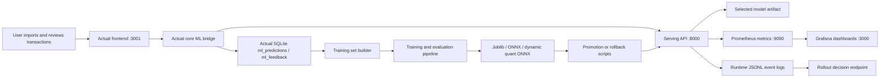
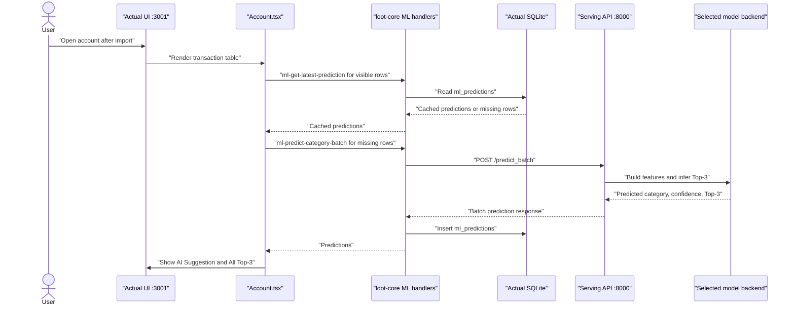
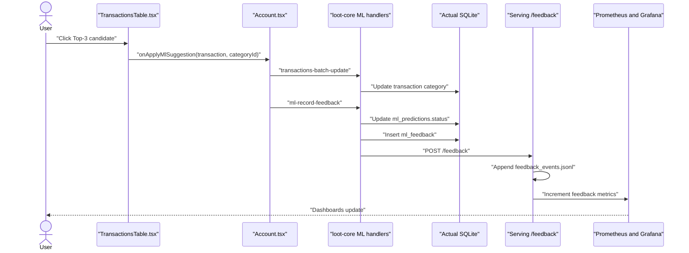
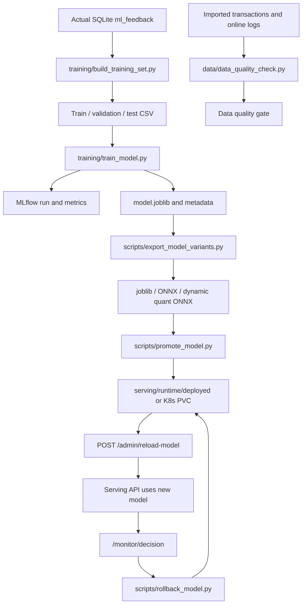

# Integrated ML System Flow Summary

This document explains the full Actual Budget smart transaction categorization
pipeline from service startup to user feedback, monitoring, retraining, model
optimization, promotion, and rollback. It is written as a team handoff and final
defense reference.

## 1. One Sentence Summary

The system adds Top-3 transaction category prediction into the normal Actual
Budget account table. Actual calls the serving service for `/predict` and
`/predict_batch`, stores predictions and user feedback in Actual SQLite, mirrors
feedback to serving, monitors production behavior with Prometheus/Grafana, and
uses scheduled retraining plus rollout rules to promote or roll back model
versions.



## 2. Services, Ports, And Responsibilities

| Service                  | Local port                             | Main files                                                                                                                                 | Responsibility                                                                                      |
| ------------------------ | -------------------------------------- | ------------------------------------------------------------------------------------------------------------------------------------------ | --------------------------------------------------------------------------------------------------- |
| Actual frontend          | `3001`                                 | `packages/desktop-client/src/components/accounts/Account.tsx`, `packages/desktop-client/src/components/transactions/TransactionsTable.tsx` | Regular user flow, account table, AI Suggestion column, All Top-3 column, user click handling.      |
| Actual server-dev / sync | `5006`                                 | `packages/sync-server/`, `yarn start:server-dev`                                                                                           | Local Actual server features and sync/dev backend. This is not the main bank transaction import UI. |
| Actual core ML bridge    | Runs inside Actual                     | `packages/loot-core/src/server/ml/app.ts`, `packages/loot-core/src/server/ml/service.ts`, `packages/loot-core/src/server/ml/store.ts`      | Calls serving, persists predictions, records feedback, mirrors feedback to serving.                 |
| Serving API              | `8000`                                 | `serving/app/main.py`, `serving/app/runtime.py`, `serving/app/config.py`                                                                   | Online inference, batch inference, feedback collection, metrics, monitor summary, rollout decision. |
| Prometheus               | `9090`                                 | `serving/monitoring/prometheus.yml`, `serving/monitoring/prometheus-alerts.yml`                                                            | Scrapes serving `/metrics`, stores time-series metrics, evaluates alert rules.                      |
| Prometheus query console | `9090/consoles/actual_ml_queries.html` | `serving/monitoring/prometheus-console/actual_ml_queries.html`                                                                             | Demo-friendly recommended queries for latency, errors, predictions, feedback, and data quality.     |
| Grafana                  | `3000`                                 | `serving/monitoring/grafana/dashboards/*.json`                                                                                             | Three focused dashboards: system overview, model behavior, data quality and rollout.                |
| MLflow                   | `5000`                                 | `training/train_model.py`, `scripts/run_mlops_pipeline.py`, `k8s/ml-system/base/mlflow-platform.yaml`                                      | Tracks training runs, metrics, artifacts, model registry aliases.                                   |
| MinIO                    | `9001` console, `9000` API             | `k8s/ml-system/base/mlflow-platform.yaml`, `serving/docker-compose.yml`                                                                    | Stores MLflow artifacts for model runs.                                                             |
| Kubernetes deployment    | Cluster services                       | `k8s/ml-system/base/`, `k8s/ml-system/overlays/staging`, `k8s/ml-system/overlays/canary`, `k8s/ml-system/overlays/production`              | Chameleon deployment, staging/canary/production environments, CronJobs, HPA, shared infra.          |

Important port distinction:

| Port   | What it is                     | What to use it for                                                                               |
| ------ | ------------------------------ | ------------------------------------------------------------------------------------------------ |
| `3001` | Actual web app                 | Create/open budget files, import bank transactions, review predictions.                          |
| `5006` | Actual server-dev/sync service | Server/sync status and dev backend support. Do not use this as the main transaction import page. |
| `8000` | ML serving API                 | API docs, prediction smoke tests, monitor summary and rollout decision.                          |
| `9090` | Prometheus                     | Query metrics and alerts.                                                                        |
| `3000` | Grafana                        | Dashboard visualization.                                                                         |
| `5000` | MLflow                         | Training run and model registry audit trail.                                                     |
| `9001` | MinIO console                  | Artifact storage inspection.                                                                     |

## 3. Startup And Manual Operations

### Local demo startup

The easiest local command is:

```bash
bash scripts/final_project_test.sh
```

This script does the following:

| Step                         | File                                                      | What happens                                                                                         |
| ---------------------------- | --------------------------------------------------------- | ---------------------------------------------------------------------------------------------------- |
| Generate realistic data      | `scripts/generate_actual_bank_import.py`                  | Creates QIF import data, CSV inspection data, batch prediction payload, and synthetic training data. |
| Start serving and monitoring | `serving/run.py monitor-up`, `serving/docker-compose.yml` | Starts serving, Prometheus, Grafana, MLflow, and MinIO when Docker Compose is available.             |
| Warm up serving              | `curl /readyz`, `curl /predict_batch`                     | Sends realistic batch traffic so dashboards are not empty.                                           |
| Publish data quality         | `data/data_quality_check.py ingestion`                    | Posts ingestion quality metrics to serving `/monitor/data-quality`.                                  |
| Exercise promotion/rollback  | `scripts/simulate_promotion_rollback.py`                  | Generates evidence that promotion and rollback scripts can execute.                                  |
| Start Actual                 | `yarn start:server-dev`                                   | Starts Actual frontend on `3001` and server-dev/sync on `5006`.                                      |
| Open service pages           | `scripts/final_project_test.sh`                           | Opens Actual, serving docs, monitor endpoints, Prometheus, Grafana, and MLflow.                      |

### Manual user steps during demo

| User action                                               | System response                                                                                  | Responsible code                                              |
| --------------------------------------------------------- | ------------------------------------------------------------------------------------------------ | ------------------------------------------------------------- |
| Open `http://127.0.0.1:3001`                              | Actual frontend loads.                                                                           | `yarn start:server-dev`, `packages/desktop-client/`           |
| Choose `Create test file`                                 | Actual creates a realistic budget file.                                                          | Existing Actual test-file flow.                               |
| Open a checking account and choose `Import`               | Actual imports bank transactions into the account.                                               | Existing Actual account import flow.                          |
| Import `artifacts/test-data/actual_bank_transactions.qif` | New rows appear in the transaction table.                                                        | Generated by `scripts/generate_actual_bank_import.py`.        |
| Open the account table                                    | Missing predictions are requested in batch.                                                      | `Account.tsx` calls `ml-predict-category-batch`.              |
| Review `AI Suggestion` and `All Top-3`                    | Top-1 suggestion is highlighted and Top-3 choices are clickable.                                 | `TransactionsTable.tsx`.                                      |
| Click another Top-3 category                              | Category updates and feedback is recorded for retraining.                                        | `Account.tsx`, `ml-record-feedback`, `store.ts`, `/feedback`. |
| Open Grafana/Prometheus                                   | Metrics show traffic, confidence, latency, feedback, data quality, and rollout decision signals. | `serving/app/main.py`, `serving/monitoring/`.                 |

### Chameleon startup

On a fresh Chameleon VM:

```bash
git clone <repo-url>
cd actual
git switch serving
bash bootstrap_chameleon.sh
```

The root `bootstrap_chameleon.sh` delegates to `scripts/chameleon_bootstrap.sh`.
It installs Docker/Compose, Node/Yarn, Python dependencies, starts the local
stack, generates test data, and prints service URLs.

For Kubernetes on Chameleon, use the integrated manifests:

```bash
kubectl apply -k k8s/ml-system/overlays/staging
kubectl apply -k k8s/ml-system/overlays/canary
kubectl apply -k k8s/ml-system/overlays/production
```

## 4. Prediction Flow From Import To Top-3 UI

The prediction step happens when the account table loads or refreshes, not at a
separate standalone ML page. This satisfies the requirement that the
complementary ML feature is implemented inside the selected open source service.



Prediction responsibilities:

| Stage           | Code                                                                        | Details                                                                                                                  |
| --------------- | --------------------------------------------------------------------------- | ------------------------------------------------------------------------------------------------------------------------ |
| Build payload   | `packages/desktop-client/src/components/accounts/Account.tsx`               | `buildPredictionPayload()` sends description, amount, date, account, country, currency, notes, and imported description. |
| Read cache      | `packages/loot-core/src/server/ml/app.ts`                                   | `ml-get-latest-prediction` avoids unnecessary serving calls for rows that already have a prediction.                     |
| Call serving    | `packages/loot-core/src/server/ml/service.ts`                               | `predictCategory()` calls `/predict`; `predictCategoryBatch()` calls `/predict_batch`.                                   |
| Persist result  | `packages/loot-core/src/server/ml/store.ts`                                 | `savePrediction()` writes to `ml_predictions`.                                                                           |
| Serve inference | `serving/app/main.py`                                                       | `/predict` and `/predict_batch` call the active backend and emit metrics/logs.                                           |
| Build features  | `serving/app/feature_adapter.py`                                            | Converts request payloads into the feature frame expected by sklearn/ONNX artifacts.                                     |
| Select backend  | `serving/app/runtime.py`, `serving/app/config.py`                           | `BACKEND_KIND=auto` reads `selected_model.json` and loads joblib, ONNX, or dynamic-quantized ONNX.                       |
| Render columns  | `packages/desktop-client/src/components/transactions/TransactionsTable.tsx` | Shows `AI Suggestion` and `All Top-3`, with the selected candidate highlighted.                                          |

## 5. Feedback Flow After User Clicks A Prediction

When the user clicks a Top-3 option, the transaction category changes and the
feedback event becomes training and monitoring data.



Feedback storage and monitoring:

| Destination     | File/table                                                            | What is stored                                                                                  | Why it matters                                                        |
| --------------- | --------------------------------------------------------------------- | ----------------------------------------------------------------------------------------------- | --------------------------------------------------------------------- |
| Actual SQLite   | `ml_predictions`                                                      | Transaction id, model version, top prediction, confidence, Top-3 JSON, status.                  | Keeps per-transaction prediction history in the application database. |
| Actual SQLite   | `ml_feedback`                                                         | Transaction id, model version, predicted category, Top-3 JSON, final category, feedback status. | Builds retraining data and allows acceptance-rate evaluation.         |
| Serving runtime | `serving/runtime/feedback_events.jsonl`                               | Mirrored online feedback events.                                                                | Drives `/monitor/summary`, `/monitor/decision`, and local audit logs. |
| Prometheus      | `feedback_total`, `feedback_match_total`, `feedback_top3_match_total` | Feedback volume, Top-1 match, Top-3 match.                                                      | Supports model behavior monitoring and rollback triggers.             |
| Grafana         | `Model Behavior` dashboard                                            | Acceptance and prediction behavior over time.                                                   | Demo evidence for serving monitoring responsibility.                  |

Feedback status values in `packages/loot-core/src/server/ml/store.ts`:

| Status          | Meaning                                                     |
| --------------- | ----------------------------------------------------------- |
| `accepted_top1` | User kept/clicked the model's highest-confidence category.  |
| `accepted_top3` | User selected another category from the model's Top-3 list. |
| `overridden`    | User selected a category outside the Top-3 candidates.      |

## 6. Monitoring: What We Watch And Why

Serving owns production behavior monitoring. The service records operational
metrics, model output metrics, user feedback metrics, and data quality metrics.

| Monitoring area    | Metrics or endpoint                                                                                                  | Code                                                       | Why it exists                                                            |
| ------------------ | -------------------------------------------------------------------------------------------------------------------- | ---------------------------------------------------------- | ------------------------------------------------------------------------ |
| Operational health | `/healthz`, `/readyz`, FastAPI HTTP metrics                                                                          | `serving/app/main.py`, `prometheus_fastapi_instrumentator` | Confirms serving is alive and measures request count/latency/errors.     |
| Prediction output  | `prediction_confidence`, `predicted_class_total`, `serving/runtime/prediction_events.jsonl`                          | `serving/app/main.py`                                      | Detects low-confidence predictions or class collapse.                    |
| User feedback      | `feedback_total`, `feedback_match_total`, `feedback_top3_match_total`, `/feedback`                                   | `serving/app/main.py`                                      | Measures whether users accept Top-1 or at least one Top-3 suggestion.    |
| Data quality       | `actual_data_quality_pass`, `actual_data_quality_issue_count`, `actual_data_quality_metric`, `/monitor/data-quality` | `data/data_quality_check.py`, `serving/app/main.py`        | Tracks ingestion quality, training-set quality, and online drift.        |
| Rollout decision   | `/monitor/summary`, `/monitor/decision`                                                                              | `serving/app/main.py`                                      | Converts metrics into promote/rollback recommendations.                  |
| Dashboards         | Grafana JSON dashboards                                                                                              | `serving/monitoring/grafana/dashboards/`                   | Visual evidence for the final demo and production run.                   |
| Alerts             | Prometheus alert rules                                                                                               | `serving/monitoring/prometheus-alerts.yml`                 | Raises problems for latency, errors, feedback quality, and data quality. |

Current dashboard design is intentionally compact:

| Dashboard              | URL                                                                           | Purpose                                                                                    |
| ---------------------- | ----------------------------------------------------------------------------- | ------------------------------------------------------------------------------------------ |
| System Overview        | `http://127.0.0.1:3000/d/actual-ml-system-overview/actual-ml-system-overview` | One-page view of request rate, latency, errors, service health, and model version context. |
| Model Behavior         | `http://127.0.0.1:3000/d/actual-ml-model-behavior/model-behavior`             | Prediction distribution, confidence, Top-1 feedback, and Top-3 feedback.                   |
| Data Quality & Rollout | `http://127.0.0.1:3000/d/actual-ml-data-rollout/data-quality-and-rollout`     | Data quality stages, rollout safety, promotion/rollback evidence.                          |

Prometheus recommended queries are available at:

```text
http://127.0.0.1:9090/consoles/actual_ml_queries.html
```

## 7. Promotion And Rollback Thresholds

The serving service exposes `/monitor/decision`. It does not blindly replace
models; it first checks sample size, feedback volume, latency, error rate, and
acceptance quality.

| Decision                           | Default threshold | Meaning                                                           |
| ---------------------------------- | ----------------- | ----------------------------------------------------------------- |
| Promotion minimum requests         | `100`             | Candidate needs enough online traffic before promotion.           |
| Promotion minimum feedback         | `20`              | Candidate needs enough user feedback before promotion.            |
| Promotion max p95 latency          | `100 ms`          | Candidate must stay fast enough for interactive UI use.           |
| Promotion max error rate           | `1%`              | Candidate must be operationally stable.                           |
| Promotion minimum Top-1 acceptance | `60%`             | Users should accept the first suggestion often enough.            |
| Promotion minimum Top-3 acceptance | `80%`             | The Top-3 feature should be useful even when Top-1 is wrong.      |
| Rollback minimum requests          | `20`              | Production needs enough traffic before rollback is evaluated.     |
| Rollback minimum feedback          | `10`              | Production needs enough feedback to judge user quality.           |
| Rollback max p95 latency           | `250 ms`          | Roll back if serving becomes too slow.                            |
| Rollback max error rate            | `2%`              | Roll back if inference becomes unreliable.                        |
| Rollback minimum Top-1 acceptance  | `45%`             | Roll back if users reject the top suggestion too often.           |
| Rollback minimum Top-3 acceptance  | `70%`             | Roll back if even the Top-3 candidates stop matching user choice. |

Threshold files:

| Environment | File                                                   | Notes                                                           |
| ----------- | ------------------------------------------------------ | --------------------------------------------------------------- |
| Base        | `k8s/ml-system/base/kustomization.yaml`                | Default thresholds for shared deployment.                       |
| Staging     | `k8s/ml-system/overlays/staging/kustomization.yaml`    | Lower sample-size thresholds for quick validation.              |
| Canary      | `k8s/ml-system/overlays/canary/kustomization.yaml`     | Candidate context; can recommend `promote_candidate`.           |
| Production  | `k8s/ml-system/overlays/production/kustomization.yaml` | Conservative rollback context; can recommend `rollback_active`. |

The actual decision logic is in `serving/app/main.py` inside `_monitor_decision()`.
The executor is `serving/tools/execute_rollout_action.py`.

## 8. Retraining, Evaluation, Packaging, Promotion, Rollback

The retraining loop turns feedback into a challenger model, evaluates it, builds
optimized artifacts, and promotes only if the gates pass.



Automation schedule:

| Context                          | Trigger                          | Frequency                                                                                                | Files                                                                                                                                                   |
| -------------------------------- | -------------------------------- | -------------------------------------------------------------------------------------------------------- | ------------------------------------------------------------------------------------------------------------------------------------------------------- |
| Local compressed week simulation | `scripts/run_week_simulation.py` | Retraining every `24` simulated hours by default; rollout decision every `6` simulated hours by default. | `scripts/run_week_simulation.py`, `scripts/run_mlops_pipeline.py`, `serving/tools/execute_rollout_action.py`                                            |
| K8s base                         | CronJob                          | Data quality every `30` minutes, retraining every `6` hours, rollout decision every `15` minutes.        | `k8s/ml-system/base/data-quality-cronjob.yaml`, `k8s/ml-system/base/training-pipeline-cronjob.yaml`, `k8s/ml-system/base/rollout-decision-cronjob.yaml` |
| K8s staging                      | CronJob overlay                  | Inherits base retraining frequency; lower feedback/request thresholds.                                   | `k8s/ml-system/overlays/staging/kustomization.yaml`                                                                                                     |
| K8s canary                       | CronJob overlay                  | Retraining every `3` hours; candidate rollout context.                                                   | `k8s/ml-system/overlays/canary/kustomization.yaml`                                                                                                      |
| K8s production                   | CronJob overlay                  | Retraining every `12` hours; production rollback context.                                                | `k8s/ml-system/overlays/production/kustomization.yaml`                                                                                                  |

Training and promotion gates:

| Gate                   | File                                                             | Current rule                                                                                                         |
| ---------------------- | ---------------------------------------------------------------- | -------------------------------------------------------------------------------------------------------------------- |
| Data quality gate      | `scripts/run_mlops_pipeline.py`, `data/data_quality_check.py`    | Training data must pass quality checks before the model pipeline continues.                                          |
| Model family selection | `training/train_model.py`                                        | Trains multiple candidate families and selects by validation `top3_accuracy`, then `macro_f1`, then `top1_accuracy`. |
| Model registry         | `training/train_model.py`                                        | Logs runs and metrics to MLflow; registers when registry environment variables are set.                              |
| Artifact optimization  | `scripts/export_model_variants.py`                               | Exports sklearn joblib, ONNX, and dynamic-quantized ONNX; selects the fastest safe variant.                          |
| Promotion quality gate | `scripts/promote_model.py`                                       | Challenger must meet minimum `top3_accuracy`, minimum `macro_f1`, and not regress against champion metric.           |
| Runtime rollout gate   | `serving/app/main.py`, `serving/tools/execute_rollout_action.py` | Online latency, errors, Top-1 acceptance, and Top-3 acceptance decide promotion or rollback.                         |
| Rollback               | `scripts/rollback_model.py`                                      | Restores the previous archived model and reloads serving.                                                            |

## 9. Model Families And Optimized Artifact Versions

The current branch supports multiple training candidates and multiple serving
artifact formats.

Training candidates in `training/train_model.py`:

| Candidate    | Why it is useful                                                             |
| ------------ | ---------------------------------------------------------------------------- |
| `logreg`     | Strong baseline for text classification with calibrated-style probabilities. |
| `linear_svm` | Often high accuracy for sparse TF-IDF text features.                         |
| `sgd_log`    | Lightweight online-friendly logistic model family.                           |

Artifact variants generated by `scripts/export_model_variants.py`:

| Artifact               | File name                  | Serving backend      | Why it exists                                                          |
| ---------------------- | -------------------------- | -------------------- | ---------------------------------------------------------------------- |
| Baseline sklearn       | `model.joblib`             | `baseline`           | Safest reference artifact and fallback.                                |
| ONNX                   | `model.onnx`               | `onnx`               | Faster portable runtime artifact.                                      |
| Dynamic quantized ONNX | `model.dynamic_quant.onnx` | `onnx_dynamic_quant` | Smaller/faster ONNX variant when prediction parity remains acceptable. |

Variant selection policy in `selected_model.json`:

| Rule                           | Current value                                                                     |
| ------------------------------ | --------------------------------------------------------------------------------- |
| Minimum label match vs sklearn | `0.99`                                                                            |
| Minimum Top-3 match vs sklearn | `0.95`                                                                            |
| Ranking order                  | Lowest p95 latency, then smaller artifact size, then dynamic-quantized tie-break. |

Example local validation from `serving/runtime/deployed/selected_model.json`:

| Variant            |  Size MB | p50 latency ms | p95 latency ms | Throughput items/sec | Label match | Top-3 match |
| ------------------ | -------: | -------------: | -------------: | -------------------: | ----------: | ----------: |
| sklearn joblib     | `0.0326` |       `1.5608` |       `2.0542` |             `16,323` |     `1.000` |     `1.000` |
| ONNX               | `0.0209` |       `0.3320` |       `0.4771` |             `77,421` |     `1.000` |     `0.963` |
| dynamic quant ONNX | `0.0212` |       `0.2814` |       `0.3898` |             `90,613` |     `1.000` |     `0.963` |

In that run, the selected serving backend was `onnx_dynamic_quant` because it
met parity requirements and had the best p95 latency. These numbers are local
validation evidence; final Chameleon numbers may differ because VM CPU and load
are different.

## 10. Data, Training, Serving, Frontend Role Mapping

| Role                    | Main responsibility                                                                         | Files                                                                                                                                                                                                  |
| ----------------------- | ------------------------------------------------------------------------------------------- | ------------------------------------------------------------------------------------------------------------------------------------------------------------------------------------------------------ |
| Frontend integration    | Make the ML feature visible and usable in the normal Actual flow.                           | `packages/desktop-client/src/components/accounts/Account.tsx`, `packages/desktop-client/src/components/transactions/TransactionsTable.tsx`                                                             |
| Actual core integration | Connect frontend requests to serving and persist prediction/feedback tables.                | `packages/loot-core/src/server/ml/app.ts`, `packages/loot-core/src/server/ml/service.ts`, `packages/loot-core/src/server/ml/store.ts`, `packages/loot-core/migrations/1766000000000_add_ml_tables.sql` |
| Data                    | Generate/import data, validate ingestion, validate training set, monitor online drift.      | `scripts/generate_actual_bank_import.py`, `data/data_quality_check.py`, `data/online_features.py`, `training/build_training_set.py`                                                                    |
| Training                | Train candidate models, evaluate quality, log to MLflow, register artifacts.                | `training/train_model.py`, `scripts/run_mlops_pipeline.py`                                                                                                                                             |
| Serving                 | Online inference, monitoring, rollout decision, model reload, promotion/rollback execution. | `serving/app/`, `serving/tools/execute_rollout_action.py`, `scripts/promote_model.py`, `scripts/rollback_model.py`                                                                                     |
| DevOps/platform         | Compose/K8s deployment, monitoring stack, CronJobs, HPA, shared infra.                      | `serving/docker-compose.yml`, `k8s/ml-system/base/`, `k8s/ml-system/overlays/`                                                                                                                         |

## 11. Where The System Stores Evidence

| Evidence                    | Location                                                                    | Used by                                                   |
| --------------------------- | --------------------------------------------------------------------------- | --------------------------------------------------------- |
| Per-transaction predictions | Actual SQLite table `ml_predictions`                                        | UI cache, feedback status, audit trail.                   |
| User corrections/acceptance | Actual SQLite table `ml_feedback`                                           | Training set builder and acceptance analysis.             |
| Online serving requests     | `serving/runtime/request_events.jsonl`                                      | `/monitor/summary`, `/monitor/decision`, local debugging. |
| Online prediction events    | `serving/runtime/prediction_events.jsonl`                                   | Prediction distribution and confidence monitoring.        |
| Online feedback events      | `serving/runtime/feedback_events.jsonl`                                     | Acceptance monitoring and rollback triggers.              |
| Data quality events         | `serving/runtime/data_quality_events.jsonl`                                 | Data quality dashboard and rollout context.               |
| Training run metrics        | MLflow                                                                      | Model comparison, registry, final report evidence.        |
| Deployed model bundle       | `serving/runtime/deployed/` locally, `/workspace/artifacts/deployed` in K8s | Serving runtime model loading.                            |
| Archived old model          | `serving/runtime/archive/` locally, `/workspace/artifacts/archive` in K8s   | Rollback source.                                          |
| Prometheus metrics          | Prometheus TSDB                                                             | Dashboards and alerts.                                    |
| Grafana dashboards          | Provisioned from `serving/monitoring/grafana/dashboards/`                   | Visual demo and production monitoring.                    |

The `serving/runtime/*.jsonl` files are generated at runtime. For example,
`feedback_events.jsonl` appears after the first `/feedback` event, and
`data_quality_events.jsonl` appears after the first `/monitor/data-quality`
post.

## 12. End-To-End Test Script Order

Use this order for final defense testing:

| Order | Command or action                                                                                  | Expected result                                                                          |
| ----: | -------------------------------------------------------------------------------------------------- | ---------------------------------------------------------------------------------------- |
|     1 | `git switch serving && git pull origin serving`                                                    | Team is on the integrated branch.                                                        |
|     2 | `yarn install`                                                                                     | Actual dependencies are installed.                                                       |
|     3 | `bash scripts/final_project_test.sh`                                                               | Services start, realistic data is generated, dashboards open.                            |
|     4 | Open `http://127.0.0.1:3001`                                                                       | Actual frontend is available.                                                            |
|     5 | Create test file, open checking account, import `artifacts/test-data/actual_bank_transactions.qif` | Transactions appear in the account table.                                                |
|     6 | Observe `AI Suggestion` and `All Top-3`                                                            | Batch predictions are displayed with confidence scores.                                  |
|     7 | Click a non-top candidate                                                                          | Transaction category changes and feedback is logged.                                     |
|     8 | Open `http://127.0.0.1:8000/monitor/summary`                                                       | Request, prediction, feedback, and data quality summary updates.                         |
|     9 | Open Prometheus query console                                                                      | Recommended queries show serving/model/data signals.                                     |
|    10 | Open Grafana dashboards                                                                            | Overview, model behavior, and data/rollout dashboards show production behavior.          |
|    11 | Optional: `python3 scripts/run_week_simulation.py --simulated-hours 168 --seconds-per-hour 1`      | Compressed one-week traffic simulation runs retraining and rollout checks automatically. |

## 13. Requirement Traceability

| Requirement                           | Current implementation                                                                                                                                                          |
| ------------------------------------- | ------------------------------------------------------------------------------------------------------------------------------------------------------------------------------- |
| Unified integrated ML system          | Actual frontend, Actual core, serving, training, data quality, monitoring, MLflow, and deployment manifests are connected in one branch.                                        |
| ML feature inside open source service | Prediction columns are implemented inside Actual's account transaction table.                                                                                                   |
| Production data to inference          | Imported transactions trigger batch prediction through Actual core to serving.                                                                                                  |
| Feedback capture                      | User click updates category, writes `ml_feedback`, and mirrors feedback to serving `/feedback`.                                                                                 |
| Retraining                            | `training/build_training_set.py` and `scripts/run_mlops_pipeline.py` turn feedback/training CSV into challenger models.                                                         |
| Evaluation                            | `training/train_model.py` evaluates model families; `scripts/promote_model.py` applies quality gates.                                                                           |
| Packaging                             | `scripts/export_model_variants.py` creates joblib, ONNX, and dynamic-quantized ONNX artifacts.                                                                                  |
| Deployment                            | Local Compose and `k8s/ml-system` manifests deploy serving, monitoring, MLflow, and Actual services.                                                                            |
| Promotion                             | Candidate context can recommend and execute promotion when thresholds pass.                                                                                                     |
| Rollback                              | Production context can recommend rollback when latency, errors, or feedback quality degrade.                                                                                    |
| Monitoring                            | Prometheus/Grafana track operational metrics, model output, user feedback, data quality, and rollout decisions.                                                                 |
| Safeguarding                          | Top-3 transparency, confidence scores, user override, feedback audit trail, data quality checks, conservative rollout gates, and rollback are implemented as active mechanisms. |
| Kubernetes for four-person team       | `k8s/ml-system/overlays/staging`, `canary`, and `production` provide the Chameleon K8s structure.                                                                               |

## 14. What To Say In The Final Presentation

A concise explanation:

> When users import transactions into Actual, the account table asks our serving
> service for batch Top-3 category predictions. Actual stores the prediction in
> SQLite and shows both the selected suggestion and all Top-3 candidates with
> confidence scores. If the user clicks a different candidate, Actual updates the
> transaction category and logs feedback in `ml_feedback`. That same event is
> mirrored to serving, where Prometheus and Grafana monitor model output,
> latency, errors, data quality, and acceptance rates. Scheduled automation then
> builds a retraining dataset, trains multiple model families, exports joblib,
> ONNX, and dynamic-quantized ONNX artifacts, chooses the fastest safe artifact,
> and promotes it only if quality gates pass. If production behavior degrades,
> the serving rollout job restores the previous archived model and reloads the
> serving process.

## 15. Current Caveats And Next Checks

| Area                       | Status                                                         | Recommended next check                                                                                                                               |
| -------------------------- | -------------------------------------------------------------- | ---------------------------------------------------------------------------------------------------------------------------------------------------- |
| Chameleon K8s              | Manifests exist for staging/canary/production.                 | Apply them on the real Chameleon cluster and record resource/port-forward evidence.                                                                  |
| MLflow registry            | Training scripts log/register when MLflow env vars are set.    | During final run, confirm model aliases in MLflow UI after promotion/rollback.                                                                       |
| Real imported bank data    | QIF import test data is generated.                             | Use the account-level `Import` button, not the file-manager `Import file` option.                                                                    |
| Week-long traffic          | Local compressed simulation exists.                            | On Chameleon, use K8s CronJobs for the week-long unattended run and record videos periodically.                                                      |
| Additional training models | Current branch includes `logreg`, `linear_svm`, and `sgd_log`. | If the training teammate has more models, add them into `training/train_model.py` as additional candidates so the same automation can evaluate them. |
